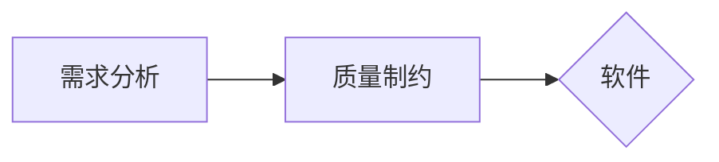

# 时代背景
## 软件工程发展：
1.0：诞生（1968）工程化、规范化
 - 需求分析->设计->开发->测试->运维
 - 瀑布模型.（Flow from here to there, step by step）

2.0：敏捷（2001，敏捷宣言） Dev/Ops，快迭代，轻量级

3.0：智能（2023，GPT-4 released）人机协作，极致敏捷
（Github Copilot, codeium...）
- 数字化
- AIGC
- 持续交付
- 人机交互智能：*软件研发过程就是人机交互过程*
- 以模型和数据为本 
大模型可以做：代码生成、测试用例生成、代码文档、代码翻译、bug 修复

# 1.2 软件工程是什么
## 框架
- 工程
- 软件
- 软件的特点
- 软件的类型
- 软件危机

## 工程
各行各业都有。
- 构想
- 分析
- 建设
- 交付
- 运行
All is enginnering.
For IT software: 横纵两条线
- 横向
	- 市场部、产品部、研发部、测试部...
- 纵向
	- 按照软件项目来组织，从各个部门抽调合适的人来进行。
## 软件
### 特点
- 复杂性：人类创造的最复杂的系统类型
- 不可见性：看不到源代码如何具体被执行
- 易变性：看上去很容易修改
- 服从性：系统中其他的组成、用户、行业系统
- 非连续性：输入很小的变化引起输出极大的变化
No Silver Bullet, or 大规模提高软件开发效率的快速办法，将来也没有

### 类型
- 按功能
	- 系统软件、应用软件、支撑软件 (develop)
- 按规模
	随着 KLOC（kilo Line of Code）上涨，coding 工作占比降低，而 debug, 编写文档的工作占比提升

《人月神话》（人月：衡量开发过程的单位）
不存在的**银弹**
以上二者都是软件工程的经典论著。

## 软件工程历史
### 软件开发历程
- 程序设计阶段
	- 1 st gen.（电子管）节省空间、编程技巧、无明确分工、无文档
	- 2 nd，3 rd. （晶体管）（集成电路）软件作坊、产品软件，软件概念建立. 瀑布模型. 
		- IBM
		- 个体作坊：依靠个人能力，缺乏合作，关注储存时空，程序规模小功能单一。
	- 4 th（大规模集成电路）

软件开发历程
- 进度难以控制
- 质量难以保证
- 软件维护困难

# 软件设计
针对软件需求，综合考虑各种制约因素，探究软件实现的解决方案。
设计前提：**软件需求**、
- what you needto do
设计考虑：**制约因素**

> [!note] 
> 直接根据软件需求来编码可行吗？

一般认为不可行。
- 缺乏设计环节，会导致系统性风险
	- 架构缺失（未定义如何做，架构可能出现问题）
	- 技术债务：没有前期设计评审，后期重构成本可能增加 3-5 倍
- 需求理解的二义性
	- 自然语言陷阱：超 60%的软件缺陷来自于需求误解(from IEEE)
	- 可测试性破坏：未经过设计的代码往往难以进行单元测试
- 工程实践化的缺失
	- 未经设计的代码难以测试

## 体系结构
- 分层的软件体系结构
