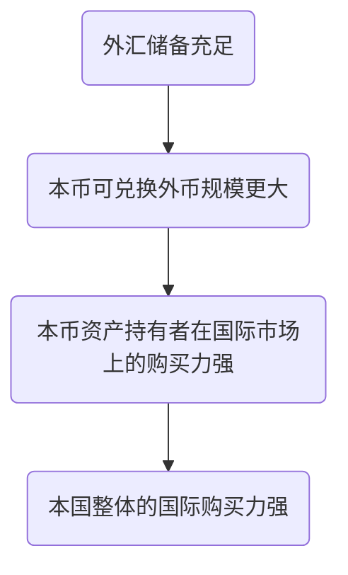
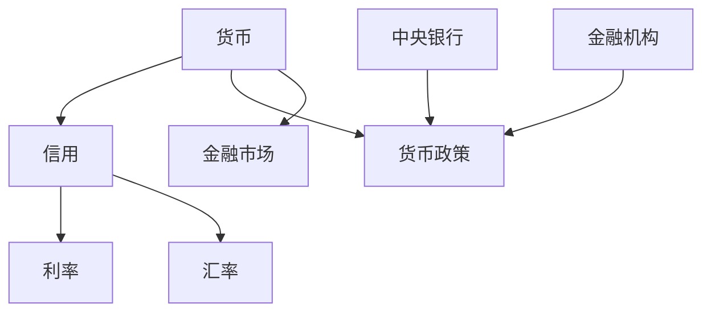

# 金融基础知识
- 五篇大文章（应用场景不同）
	- 科技金融
	- 绿色金融
	- 普惠金融
	- 养老金融
	- 数字金融
- 当前中国金融系统的几个典型特点：
	- 强调金融服务而非经济的金融化（金融与实体平衡，避免资金空转）
	- 以间接融资为主（银行的中心化职能很强，国有机构主导）
	- 中央事权，强监管体系
	- 审慎投资侧的金融创新，推动募投管退的金融创新（VC\PE\CVC）
# 信用
解决两大现实经济问题：
- 商品交易困难
- 货币分布不均衡
通过信用体系：赊购赊销，实现商品的价值->解决社会资源的不合理配置

## 信用的产生
- 早期信用
	- 货币借贷基于个人信任
- 商业信用
	- 汇票本票
- 银行信用
	- 银行吸收存款、发放贷款
- 多种信用工具
	- 债券
	- 股票
	- 金融衍生品
- 信用现代化
	- 信用评分模型
	- 大数据分析
- 全球信用
	- 国际金融市场的全球信用网络

### 信用和货币之间的关系
- 货币是信用的载体：
	- 货币是信用交易的中介 
	- 降低了交易成本
	- 双方更容易履行业务
- 信用创造货币：
	- 银行通过贷款创造信用的同时创造货币（levarage）
**货币的产生伴随着信用的产生**

## Some attention
Credit in fact is a kind of moral rule. 
大额度的违约 in fact only happen once

## 信用工具

信用工具又称为金融工具、融资工具。
是以书面形式发行和流通的，借以保证债权债务双方权利和义务具有法律效力的凭证。

- 票据
	付款人“借用”银行或者第三方的信用。存入一笔“保证金”。收款人可以要求银行贴现来提前拿到货款。
	狭义上的票据，即我国《[票据法](https://baike.baidu.com/item/%E7%A5%A8%E6%8D%AE%E6%B3%95/6883761?fromModule=lemma_inlink)》中规定的“票据”，包括汇票、[银行本票](https://baike.baidu.com/item/%E9%93%B6%E8%A1%8C%E6%9C%AC%E7%A5%A8/8642895?fromModule=lemma_inlink)和支票，是指由[出票人](https://baike.baidu.com/item/%E5%87%BA%E7%A5%A8%E4%BA%BA/1754894?fromModule=lemma_inlink)签发的、约定自己或者委托付款人在[见票](https://baike.baidu.com/item/%E8%A7%81%E7%A5%A8/7921669?fromModule=lemma_inlink)时或指定的日期向收款人或持票人无条件支付一定金额的有价证券
（与供应链信用（上下游借信用）不同，票据使用保证金来和银行借用信用）

- 债券
	- 国家或公司发行。
- 股票
	- 中国有
		- A 股（人民币标价，人民币结算）
		- B 股
		- H 股（香港）
		- N 股，S 股（纽约、新加坡）
- 衍生工具
	- 种类
		- 股指期货
		- 外汇期货
		- 利率期货
		- 商品期货
	- 交易所
		- 上海期货交易所、郑州商品交易所、大连商品交易所、广州期货交易所、中国金融期货交易所。

# 利率
### 利率的基本规律
利率是本质是一种 **补偿**
——我借给你钱，延迟使用这这笔钱，对于这部分时间你需要给我一定的补偿。
最根本的作用：
1. 吸引闲置资金投入到经济活动中

年化利率：为了体现长期收益，放大利率数字，将一定时间内的收益换算到一年的利率水平..

### 信用和利率的关系

信用是指 *以偿还本金和支付利息为条件的货币借贷行为*
利率是指 *借贷期满的利息总额与贷出本金总额的比率*

名义利率：用货币数量所表示的利率，常指借贷合同书面规定的利率或证券的票面利率
实际利率：是指名义利率扣除通货膨胀率（CPI）之后的利率，也叫真实利率
真实价格：名义价格扣除通货膨胀率（CPI）之后的价格规模

- 有时候实际利率为负数，为什么还会有人存款？
	- 闲置资金无法归零
	- 名义利率依然为正（不储蓄或投资，亏的更多）
	- 通货膨胀传导不均匀。货币供给增多，对于消费品的价格影响个人感受更靠后。
- 特殊的-日本负利率政策鼓励消费和刺激经济。

# 外汇
## 外汇储备与国际购买力
外汇储备充足->本币可兑换外币规模更大->本币资产持有者在国际市场上的购买力强->本国整体的国际购买力强

## 外汇汇率
- 在岸汇率（Onshore）：境内流通用于结算 CNY
- 离岸汇率（Offshore）：境外经营存放款业务 CNH

- 基本汇率：本国货币与基准货币或关键货币的汇率（基本上都是美元）
- 套算汇率：根据基本汇率换算的
- 有效汇率（不是实际的，概念化的）：本国货币对于多种外国货币的双边汇率加**权**（一般根据本国和对象国的贸易密度）平均。（相较于贸易伙伴的货币升贬值情况）

## 汇率制度
- 单独浮动：对外价值不与任何外国货币发生固定联系（￥$ € £）
- 钉住浮动：本国货币钉住一种货币（作为货币锚），或若干种货币（作为货币篮），使得本国货币和这些外币的汇率保持相对稳定。
	- 以单一产业外向依赖型经济体为主。沙特里亚尔盯美元，港币盯美元，非洲法郎盯欧元
- 弹性浮动

## 货币、利率和汇率
- 货币的一项重要职能是价值尺度
- 利率是货币时间/机会成本的补偿（未来货币贴现到现在）（时间维度）
- 外汇是其他货币，以汇率作为兑换规则（其他货币与关注货币之间的转换）
## 汇率决定理论
- 购买力平价理论
- 利率平价理论
- 国际收支理论
- 资本市场理论

# 中央银行
## **定义**：
国家中居主导地位的金融中心机构，是国家干预和调控国民经济发展的重要工具。负责指定并执行国家货币信用政策，独具货币发行权，实行金融监管。

## 职能

- **发行的银行**
	- 垄断货币发行特权，全国唯一货币发行机构
- **银行的银行**
	- 不同工商企业和个人发生往来，只与商业银行和其他金融机构直接发生业务关系
- **政府的银行**
	- 政府通过中央银行管理全国金融体系
	- 提供政府需要的金融服务
## 资产负债
### 负债业务
央行的负债是指金融机构、政府、特定部门持有的中央银行的债券。
-  货币发行业务：发行（信用）货币，相当于央行对全社会负债。

-  存款业务：商业银行准备金存款、政府存款、外国存款等。

- 经理国库业务：负责办理国家预算资金的收纳和支出。

- 扩充资本业务：筹集、维持和补充自有资本。

- 其他负债业务：发行中央银行票据、对外负债
### 资产业务

央行的资产是指中央银行在一定时点上所拥有的各种债权
- 再贴现业务：商业银行通过贴现将持有的尚未到期的商业票据向中央银行申请转让，由此获得中央银行的资金融通。

- 贷款业务：短期贷款为主，不以盈利为目的，不对工商企业和个人直接发放贷款。

- 证券买卖业务：买卖国库券、承兑和贴现票据、政府债券等。

- 买卖黄金或SDR：买卖黄金实物或黄金证券。
（央妈）
## **宗旨**
- 向社会提供可靠、良好的信用流通工具，创造灵活方便的支付手段
- 制定和推行货币政策，保持本国货币价值的基本稳定
- 履行国家管理全国金融的职责，对金融业和金融市场实行有效的监督
（在中国，可以直接理解为央行是一个**政府机关**）

## 量化宽松 （Quantitative Easing, QE）
**非常规的货币政策。** 中央银行通过**购买中长期债券**（如国债，机构债券等），绕过流动性陷阱（传统的利率传导机制），向市场**注入大量流动性资金。**
（银行利率调解已经基本不起作用：期限长、规模大、短期不收回）

相对应的有 **量化紧缩**（Quantitative Tightening)

# 货币政策
**货币乘数**：
$$
k=\frac{{R_{c}+1}}{R_{d}+R_{e}+R_{c}}
$$
- $R_{c}$：现金-存款比率
- $R_{d}$：法定存款准备金率
- $R_{e}$：超额存款准备金率
## 货币政策工具

### 存款准备金政策
- 规定或调整商业银行缴存中央银行的存款准备金率来改变 **货币乘数**
- **降低存款准备金率**：积极政策，**释放流动性**
###  再贴现政策

### **公开市场政策**
### MLF 和 SLF
**常备借贷便利（Standing lending facility）SLF，“酸辣粉“**

“酸辣粉“也是央行向商业银行贷款的一种方式。这是一种于2013年推出的相对较新的金融手段，其到期期限为一至三个月 - 比公开市场操作等融资方案更长。当央行向市场注入“酸辣粉“的时候，就是释放中短期流动性，反之亦然。

为了通过这个方法获得资金，银行必须用**信用评级较高的资产作为抵押**。也就意味着这些资金通常只适用于实力雄厚的贷方。

  

**中期借贷便利**（**Medium-term lending facility**）**MLF，“麻辣粉** 
有短期借贷的“酸辣粉”，自然也有中期借贷的“麻辣粉”。商业银行可以从央行通过“麻辣粉”获得三个月到一年的贷款。这项2014年推出的融资渠 s道，允许央行向银行系统注入流动性以影响长期贷款的利率。  
与“酸辣粉”一样，银行也必须提供抵押品以获得资金。 但也有不同的地方，“麻辣粉”接受更广泛的抵押品，包括政府债券，票据，地方政府债券和小公司的高评级贷款

## 货币政策总结
- 扩张性货币政策（**总需求小于总供给，经济萧**条）
- 紧缩性货币政策（总需求大于总供给，物价高企）
	- **公开市场卖出操作**，提高贴现率，提高准备金率
	- 抑制过旺需求
- 中性/稳健货币政策（经济符合预期，使货币保持中立地位）

- 货币政策的最终目标：
	- **物价**
	- **就业**
	- **经济与国际收支**
- 货币政策的中间目标
	- **操作目标：超额准备金和基础货币，短期利率**
	- **效果目标：利率和货币供应量**

# 商业银行
## 商业银行的表外业务

# 复习课

**核心**：——货币

##
- M1 M2 都是什么？
	- 见第二周 ppt，page52 货币层次内容
![[货币层次.png]]
- 结构性货币政策？
	- MLF，SLF